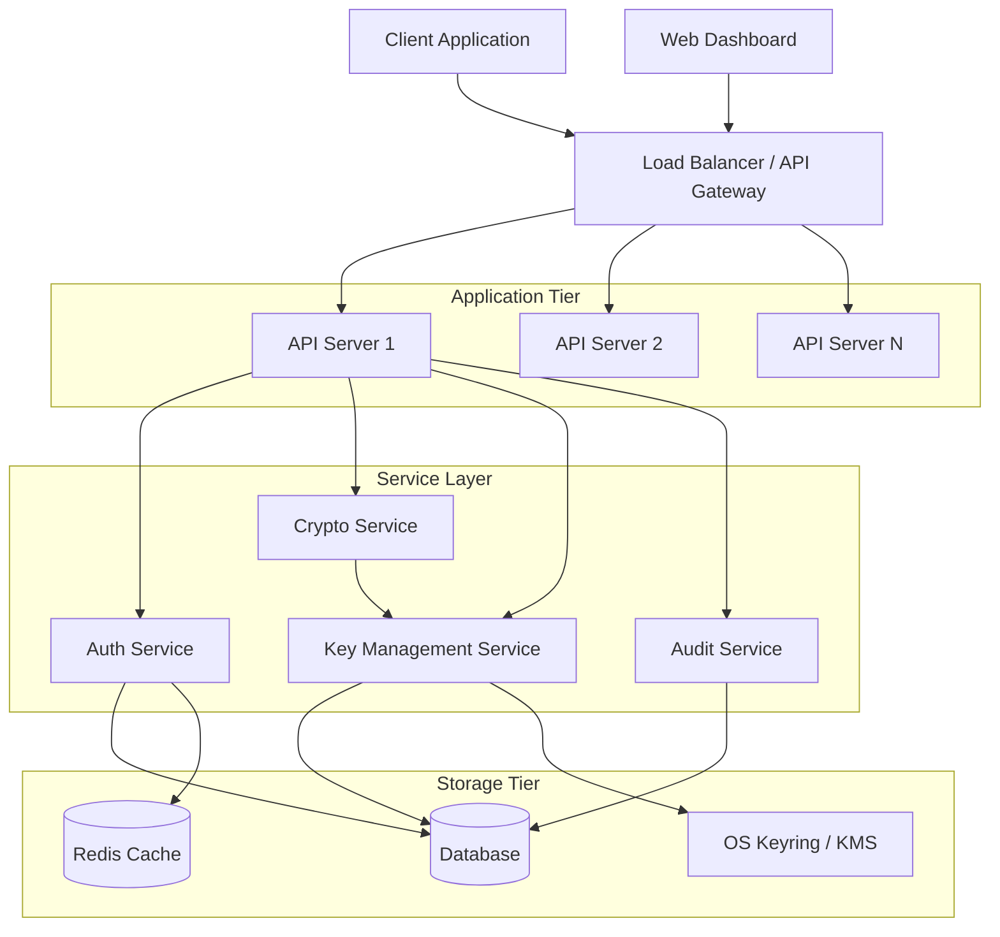

# Design Document: Secure Encryption & Key Management Service

## Overview

The Secure Encryption & Key Management Service is a production-ready system consisting of a REST API backend and web UI frontend. The service provides cryptographic operations (encryption/decryption), secure key lifecycle management, and comprehensive security controls following OWASP best practices.

The architecture follows a layered approach with clear separation between:
- **API Layer**: REST endpoints with authentication, authorization, and rate limiting
- **Service Layer**: Business logic for cryptographic operations and key management
- **Cryptography Layer**: Low-level cryptographic primitives and key derivation
- **Storage Layer**: Encrypted persistence of keys and audit logs
- **UI Layer**: Web dashboard for monitoring and management

The system is designed for deployment in cloud environments with support for horizontal scaling, observability, and disaster recovery.

## Architecture

### High-Level Architecture



### Component Architecture

**API Server**:
- Express.js/FastAPI-based REST API
- Middleware stack: HTTPS enforcement, CORS, rate limiting, authentication, authorization
- Request validation using JSON schemas
- Structured logging with correlation IDs
- Health check and metrics endpoints

**Authentication Service**:
- Session management with Redis-backed storage
- JWT generation and validation
- Password hashing with Argon2id
- TOTP-based MFA with backup codes
- Account lockout tracking

**Cryptography Service**:
- Symmetric encryption: AES-256-GCM and ChaCha20-Poly1305
- Asymmetric encryption: RSA-2048/4096 and X25519
- Key derivation: Argon2id (primary) and PBKDF2-HMAC-SHA256 (fallback)
- Secure random number generation using OS CSPRNG
- Constant-time comparison for authentication tags

**Key Management Service**:
- Key lifecycle: create, rotate, disable, revoke, backup
- Master key loading from OS keyring or cloud KMS
- Key encryption at rest using AES-256-GCM with master key
- Key metadata storage with ownership and permissions
- Atomic key rotation with rollback support

**Audit Service**:
- Structured audit log entries with cryptographic signatures
- Async log writing to avoid blocking operations
- Log retention and archival policies
- Query interface for audit log analysis

**Rate Limiter**:
- Token bucket algorithm per IP and per user
- Distributed rate limiting using Redis
- Configurable limits per endpoint
- Automatic lockout on authentication failures

## Components and Interfaces

### API Endpoints

#### Authentication Endpoints

```
POST /api/v1/auth/register
Request: { username, email, password }
Response: { userId, message }

POST /api/v1/auth/login
Request: { username, password, mfaCode? }
Response: { sessionToken or jwt, expiresAt }

POST /api/v1/auth/logout
Headers: Authorization: Bearer <token>
Response: { message }

POST /api/v1/auth/mfa/enable
Headers: Authorization: Bearer <token>
Response: { secret, qrCode, backupCodes[] }

POST /api/v1/auth/mfa/verify
Request: { code }
Response: { success, message }
```

#### Key Management Endpoints

```
POST /api/v1/keys
Headers: Authorization: Bearer <token>
Request: { 
  type: "symmetric" | "asymmetric" | "derived",
  algorithm: "AES-256-GCM" | "ChaCha20-Poly1305" | "RSA-2048" | "X25519",
  password?: string (for derived keys)
}
Response: { 
  keyId: UUID,
  type, algorithm, 
  publicKey?: string (for asymmetric),
  createdAt 
}

GET /api/v1/keys
Headers: Authorization: Bearer <token>
Query: ?status=active|disabled|revoked
Response: { 
  keys: [{ keyId, type, algorithm, status, createdAt, lastRotated }]
}

GET /api/v1/keys/:keyId
Headers: Authorization: Bearer <token>
Response: { keyId, type, algorithm, status, createdAt, lastRotated, metadata }

POST /api/v1/keys/:keyId/rotate
Headers: Authorization: Bearer <token>
Response: { oldKeyId, newKeyId, rotatedAt, reencryptedCount }

PUT /api/v1/keys/:keyId/disable
Headers: Authorization: Bearer <token>
Response: { keyId, status: "disabled", disabledAt }

PUT /api/v1/keys/:keyId/revoke
Headers: Authorization: Bearer <token>
Response: { keyId, status: "revoked", revokedAt }
```

#### Cryptographic Operation Endpoints

```
POST /api/v1/encrypt
Headers: Authorization: Bearer <token>
Request: { 
  keyId: UUID,
  plaintext: base64,
  associatedData?: base64
}
Response: { 
  ciphertext: base64,
  nonce: base64,
  tag: base64,
  algorithm
}

POST /api/v1/decrypt
Headers: Authorization: Bearer <token>
Request: { 
  keyId: UUID,
  ciphertext: base64,
  nonce: base64,
  tag: base64,
  associatedData?: base64
}
Response: { 
  plaintext: base64
}

POST /api/v1/encrypt/asymmetric
Headers: Authorization: Bearer <token>
Request: { 
  publicKeyId: UUID,
  plaintext: base64
}
Response: { 
  ciphertext: base64
}

POST /api/v1/decrypt/asymmetric
Headers: Authorization: Bearer <token>
Request: { 
  privateKeyId: UUID,
  ciphertext: base64
}
Response: { 
  plaintext: base64
}
```

#### Audit Log Endpoints

```
GET /api/v1/audit/logs
Headers: Authorization: Bearer <token>
Query: ?startDate=ISO8601&endDate=ISO8601&eventType=auth|key|crypto&userId=UUID
Response: { 
  logs: [{ 
    logId, timestamp, eventType, userId, ipAddress, 
    action, resourceId, result, metadata 
  }],
  pagination: { page, pageSize, total }
}

GET /api/v1/audit/logs/:logId
Headers: Authorization: Bearer <token>
Response: { 
  logId, timestamp, eventType, userId, ipAddress, 
  action, resourceId, result, metadata, signature 
}
```

#### Dashboard Endpoints

```
GET /api/v1/dashboard/stats
Headers: Authorization: Bearer <token>
Response: { 
  totalKeys, activeKeys, disabledKeys,
  keysNeedingRotation: [{ keyId, lastRotated, daysSinceRotation }],
  recentFailedAuth: [{ timestamp, ipAddress, username }],
  rateLimitStats: { blockedRequests, topBlockedIPs },
  operationStats: { 
    last24h: { encryptions, decryptions, keyCreations }
  }
}
```

### Service Interfaces

#### CryptoService Interface

```typescript
interface CryptoService {
  // Symmetric encryption
  encryptSymmetric(
    key: Buffer, 
    plaintext: Buffer, 
    algorithm: "AES-256-GCM" | "ChaCha20-Poly1305",
    associatedData?: Buffer
  ): { ciphertext: Buffer, nonce: Buffer, tag: Buffer }
  
  decryptSymmetric(
    key: Buffer,
    ciphertext: Buffer,
    nonce: Buffer,
    tag: Buffer,
    algorithm: "AES-256-GCM" | "ChaCha20-Poly1305",
    associatedData?: Buffer
  ): Buffer
  
  // Asymmetric encryption
  generateAsymmetricKeyPair(
    algorithm: "RSA-2048" | "RSA-4096" | "X25519"
  ): { publicKey: Buffer, privateKey: Buffer }
  
  encryptAsymmetric(
    publicKey: Buffer,
    plaintext: Buffer,
    algorithm: string
  ): Buffer
  
  decryptAsymmetric(
    privateKey: Buffer,
    ciphertext: Buffer,
    algorithm: string
  ): Buffer
  
  // Key derivation
  deriveKey(
    password: string,
    salt: Buffer,
    algorithm: "Argon2id" | "PBKDF2-HMAC-SHA256",
    params: DerivationParams
  ): Buffer
  
  // Utilities
  generateSalt(length: number): Buffer
  generateNonce(algorithm: string): Buffer
  constantTimeCompare(a: Buffer, b: Buffer): boolean
}

interface DerivationParams {
  // Argon2id params
  memoryCost?: number  // in KB, default 65536 (64 MB)
  timeCost?: number    // iterations, default 3
  parallelism?: number // threads, default 4
  
  // PBKDF2 params
  iterations?: number  // default 600000
  hashFunction?: string // default "sha256"
  
  keyLength: number    // output key length in bytes
}
```

#### KeyManagementService Interface

```typescript
interface KeyManagementService {
  // Key lifecycle
  createKey(
    userId: string,
    type: KeyType,
    algorithm: string,
    password?: string
  ): Promise<Key>
  
  getKey(keyId: string, userId: string): Promise<Key>
  
  listKeys(
    userId: string,
    filters: { status?: KeyStatus, type?: KeyType }
  ): Promise<Key[]>
  
  rotateKey(keyId: string, userId: string): Promise<RotationResult>
  
  disableKey(keyId: string, userId: string): Promise<void>
  
  revokeKey(keyId: string, userId: string): Promise<void>
  
  // Key storage
  encryptKeyMaterial(keyMaterial: Buffer): Buffer
  
  decryptKeyMaterial(encryptedKey: Buffer): Buffer
  
  // Master key management
  loadMasterKey(): Promise<Buffer>
  
  rotateMasterKey(newMasterKey: Buffer): Promise<void>
  
  // Backup and recovery
  backupKeys(userId: string): Promise<BackupFile>
  
  restoreKeys(backupFile: BackupFile): Promise<RestoreResult>
}

interface Key {
  keyId: string
  userId: string
  type: KeyType
  algorithm: string
  status: KeyStatus
  encryptedKeyMaterial: Buffer
  publicKey?: Buffer
  metadata: KeyMetadata
  createdAt: Date
  lastRotated?: Date
}

type KeyType = "symmetric" | "asymmetric" | "derived"
type KeyStatus = "active" | "disabled" | "revoked" | "deprecated"

interface KeyMetadata {
  derivationSalt?: Buffer
  derivationParams?: DerivationParams
  rotationHistory: { oldKeyId: string, rotatedAt: Date }[]
  permissions: string[]
}

interface RotationResult {
  oldKeyId: string
  newKeyId: string
  reencryptedCount: number
  rotatedAt: Date
}
```

#### AuthService Interface

```typescript
interface AuthService {
  // User management
  registerUser(
    username: string,
    email: string,
    password: string
  ): Promise<User>
  
  authenticateUser(
    username: string,
    password: string
  ): Promise<AuthResult>
  
  // Session management
  createSession(userId: string): Promise<Session>
  
  validateSession(sessionToken: string): Promise<Session>
  
  invalidateSession(sessionToken: string): Promise<void>
  
  // JWT management
  generateJWT(userId: string, role: Role): string
  
  validateJWT(token: string): JWTPayload
  
  // MFA
  enableMFA(userId: string): Promise<MFASetup>
  
  verifyMFA(userId: string, code: string): Promise<boolean>
  
  generateBackupCodes(userId: string): Promise<string[]>
  
  // Account security
  recordFailedLogin(username: string, ipAddress: string): Promise<void>
  
  isAccountLocked(username: string): Promise<boolean>
  
  unlockAccount(username: string): Promise<void>
}

interface User {
  userId: string
  username: string
  email: string
  passwordHash: string
  role: Role
  mfaEnabled: boolean
  mfaSecret?: string
  backupCodes?: string[]
  createdAt: Date
  lastLogin?: Date
}

type Role = "user" | "admin"

interface Session {
  sessionId: string
  userId: string
  createdAt: Date
  expiresAt: Date
  ipAddress: string
}

interface AuthResult {
  success: boolean
  userId?: string
  requiresMFA: boolean
  sessionToken?: string
  error?: string
}

interface MFASetup {
  secret: string
  qrCode: string
  backupCodes: string[]
}
```

#### AuditService Interface

```typescript
interface AuditService {
  // Logging
  logAuthEvent(
    eventType: "login" | "logout" | "login_failed" | "mfa_enabled",
    userId: string,
    ipAddress: string,
    metadata?: Record<string, any>
  ): Promise<void>
  
  logKeyEvent(
    eventType: "key_created" | "key_rotated" | "key_disabled" | "key_revoked",
    userId: string,
    keyId: string,
    metadata?: Record<string, any>
  ): Promise<void>
  
  logCryptoEvent(
    eventType: "encrypt" | "decrypt",
    userId: string,
    keyId: string,
    success: boolean,
    metadata?: Record<string, any>
  ): Promise<void>
  
  // Querying
  queryLogs(
    filters: AuditLogFilter,
    pagination: { page: number, pageSize: number }
  ): Promise<AuditLogPage>
  
  getLog(logId: string): Promise<AuditLog>
  
  // Integrity
  signLogEntry(log: AuditLog): string
  
  verifyLogEntry(log: AuditLog, signature: string): boolean
}

interface AuditLog {
  logId: string
  timestamp: Date
  eventType: string
  userId: string
  ipAddress: string
  action: string
  resourceId?: string
  result: "success" | "failure"
  metadata: Record<string, any>
  signature: string
}

interface AuditLogFilter {
  startDate?: Date
  endDate?: Date
  eventType?: string
  userId?: string
  result?: "success" | "failure"
}

interface AuditLogPage {
  logs: AuditLog[]
  pagination: {
    page: number
    pageSize: number
    total: number
    totalPages: number
  }
}
```

#### RateLimiter Interface

```typescript
interface RateLimiter {
  // Rate limiting
  checkLimit(
    key: string,
    limit: number,
    windowSeconds: number
  ): Promise<RateLimitResult>
  
  recordRequest(
    key: string,
    windowSeconds: number
  ): Promise<void>
  
  // Account lockout
  recordFailedAuth(username: string): Promise<void>
  
  isLocked(username: string): Promise<boolean>
  
  unlock(username: string): Promise<void>
  
  // Statistics
  getStats(key: string): Promise<RateLimitStats>
}

interface RateLimitResult {
  allowed: boolean
  remaining: number
  resetAt: Date
  retryAfter?: number
}

interface RateLimitStats {
  requestCount: number
  blockedCount: number
  windowStart: Date
  windowEnd: Date
}
```

## Data Models

### Database Schema

#### Users Table

```sql
CREATE TABLE users (
  user_id UUID PRIMARY KEY DEFAULT gen_random_uuid(),
  username VARCHAR(255) UNIQUE NOT NULL,
  email VARCHAR(255) UNIQUE NOT NULL,
  password_hash VARCHAR(255) NOT NULL,
  role VARCHAR(50) NOT NULL DEFAULT 'user',
  mfa_enabled BOOLEAN DEFAULT FALSE,
  mfa_secret_encrypted BYTEA,
  backup_codes_encrypted BYTEA,
  account_locked BOOLEAN DEFAULT FALSE,
  locked_until TIMESTAMP,
  created_at TIMESTAMP DEFAULT CURRENT_TIMESTAMP,
  last_login TIMESTAMP,
  INDEX idx_username (username),
  INDEX idx_email (email)
);
```

#### Keys Table

```sql
CREATE TABLE keys (
  key_id UUID PRIMARY KEY DEFAULT gen_random_uuid(),
  user_id UUID NOT NULL REFERENCES users(user_id) ON DELETE CASCADE,
  key_type VARCHAR(50) NOT NULL,
  algorithm VARCHAR(100) NOT NULL,
  status VARCHAR(50) NOT NULL DEFAULT 'active',
  encrypted_key_material BYTEA NOT NULL,
  public_key BYTEA,
  nonce BYTEA NOT NULL,
  tag BYTEA NOT NULL,
  derivation_salt BYTEA,
  derivation_params JSONB,
  metadata JSONB,
  created_at TIMESTAMP DEFAULT CURRENT_TIMESTAMP,
  last_rotated TIMESTAMP,
  disabled_at TIMESTAMP,
  revoked_at TIMESTAMP,
  INDEX idx_user_id (user_id),
  INDEX idx_status (status),
  INDEX idx_created_at (created_at)
);
```

#### Key Rotation History Table

```sql
CREATE TABLE key_rotation_history (
  rotation_id UUID PRIMARY KEY DEFAULT gen_random_uuid(),
  old_key_id UUID NOT NULL REFERENCES keys(key_id),
  new_key_id UUID NOT NULL REFERENCES keys(key_id),
  rotated_by UUID NOT NULL REFERENCES users(user_id),
  reencrypted_count INTEGER NOT NULL,
  rotated_at TIMESTAMP DEFAULT CURRENT_TIMESTAMP,
  INDEX idx_old_key_id (old_key_id),
  INDEX idx_new_key_id (new_key_id),
  INDEX idx_rotated_at (rotated_at)
);
```

#### Encrypted Data Table

```sql
CREATE TABLE encrypted_data (
  data_id UUID PRIMARY KEY DEFAULT gen_random_uuid(),
  user_id UUID NOT NULL REFERENCES users(user_id) ON DELETE CASCADE,
  key_id UUID NOT NULL REFERENCES keys(key_id),
  ciphertext BYTEA NOT NULL,
  nonce BYTEA NOT NULL,
  tag BYTEA NOT NULL,
  associated_data BYTEA,
  algorithm VARCHAR(100) NOT NULL,
  created_at TIMESTAMP DEFAULT CURRENT_TIMESTAMP,
  INDEX idx_user_id (user_id),
  INDEX idx_key_id (key_id)
);
```

#### Audit Logs Table

```sql
CREATE TABLE audit_logs (
  log_id UUID PRIMARY KEY DEFAULT gen_random_uuid(),
  timestamp TIMESTAMP DEFAULT CURRENT_TIMESTAMP NOT NULL,
  event_type VARCHAR(100) NOT NULL,
  user_id UUID REFERENCES users(user_id),
  ip_address INET NOT NULL,
  action VARCHAR(255) NOT NULL,
  resource_id UUID,
  result VARCHAR(50) NOT NULL,
  metadata JSONB,
  signature VARCHAR(512) NOT NULL,
  INDEX idx_timestamp (timestamp),
  INDEX idx_event_type (event_type),
  INDEX idx_user_id (user_id),
  INDEX idx_result (result)
);
```

#### Sessions Table (if using session-based auth)

```sql
CREATE TABLE sessions (
  session_id UUID PRIMARY KEY DEFAULT gen_random_uuid(),
  user_id UUID NOT NULL REFERENCES users(user_id) ON DELETE CASCADE,
  session_token VARCHAR(512) UNIQUE NOT NULL,
  ip_address INET NOT NULL,
  user_agent TEXT,
  created_at TIMESTAMP DEFAULT CURRENT_TIMESTAMP,
  expires_at TIMESTAMP NOT NULL,
  last_activity TIMESTAMP DEFAULT CURRENT_TIMESTAMP,
  INDEX idx_session_token (session_token),
  INDEX idx_user_id (user_id),
  INDEX idx_expires_at (expires_at)
);
```

#### API Keys Table

```sql
CREATE TABLE api_keys (
  api_key_id UUID PRIMARY KEY DEFAULT gen_random_uuid(),
  user_id UUID NOT NULL REFERENCES users(user_id) ON DELETE CASCADE,
  key_hash VARCHAR(512) NOT NULL,
  key_prefix VARCHAR(20) NOT NULL,
  name VARCHAR(255),
  scopes JSONB NOT NULL,
  status VARCHAR(50) NOT NULL DEFAULT 'active',
  created_at TIMESTAMP DEFAULT CURRENT_TIMESTAMP,
  last_used TIMESTAMP,
  expires_at TIMESTAMP,
  INDEX idx_user_id (user_id),
  INDEX idx_key_prefix (key_prefix),
  INDEX idx_status (status)
);
```

#### Failed Login Attempts Table

```sql
CREATE TABLE failed_login_attempts (
  attempt_id UUID PRIMARY KEY DEFAULT gen_random_uuid(),
  username VARCHAR(255) NOT NULL,
  ip_address INET NOT NULL,
  attempted_at TIMESTAMP DEFAULT CURRENT_TIMESTAMP,
  INDEX idx_username (username),
  INDEX idx_ip_address (ip_address),
  INDEX idx_attempted_at (attempted_at)
);
```

### Redis Data Structures

#### Rate Limiting

```
Key: rate_limit:ip:<ip_address>:<endpoint>
Type: String (counter)
TTL: Window duration (e.g., 900 seconds for 15 minutes)
Value: Request count

Key: rate_limit:user:<user_id>
Type: String (counter)
TTL: 60 seconds
Value: Request count
```

#### Session Storage

```
Key: session:<session_token>
Type: Hash
TTL: 86400 seconds (24 hours)
Fields:
  - user_id
  - created_at
  - ip_address
  - last_activity
```

#### Account Lockout

```
Key: lockout:<username>
Type: String
TTL: 1800 seconds (30 minutes)
Value: Lock timestamp

Key: failed_auth:<username>
Type: String (counter)
TTL: 900 seconds (15 minutes)
Value: Failed attempt count
```

## Correctness Properties

*A property is a characteristic or behavior that should hold true across all valid executions of a system—essentially, a formal statement about what the system should do. Properties serve as the bridge between human-readable specifications and machine-verifiable correctness guarantees.*

